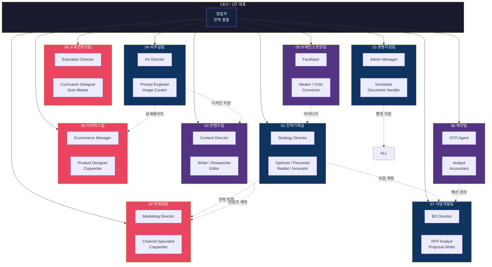
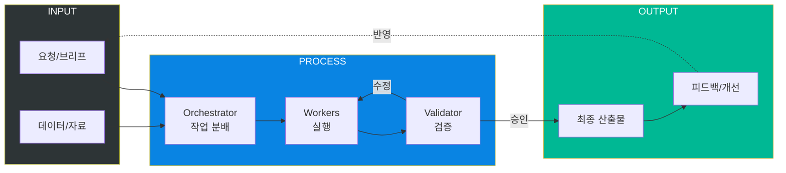
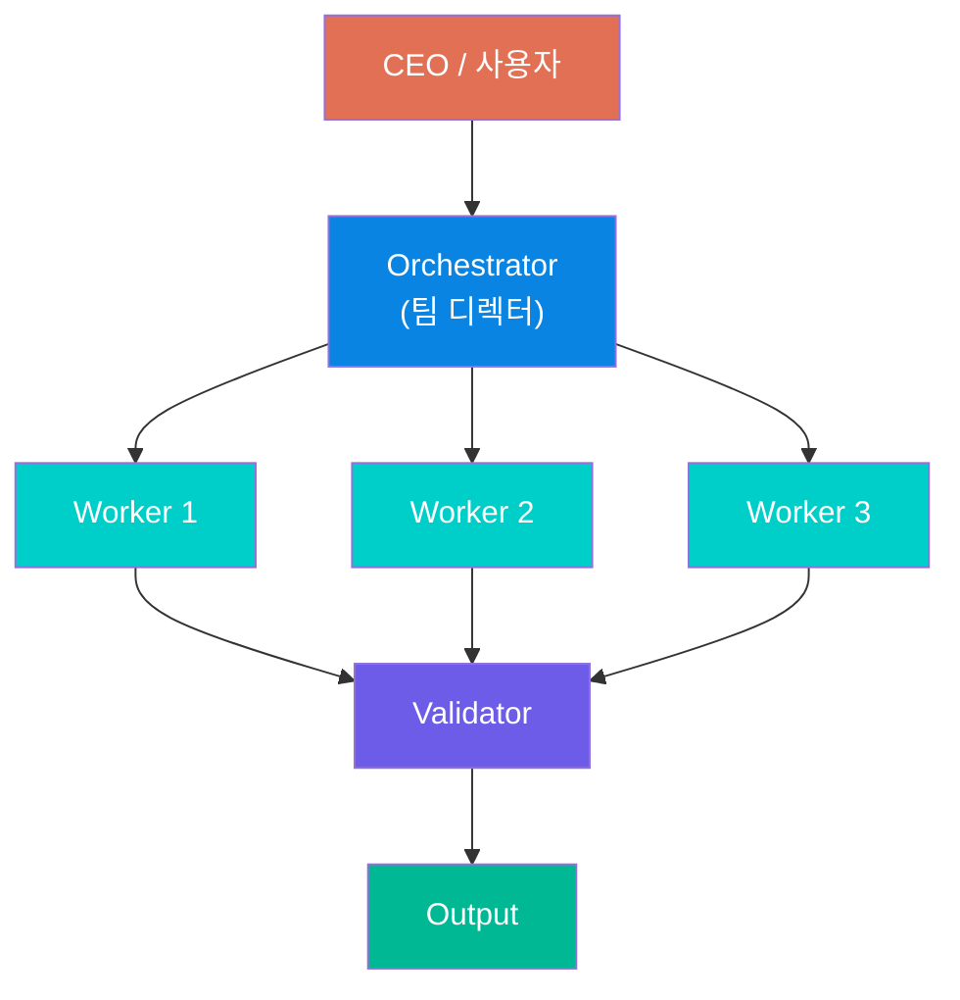

# My AI Company 조직도

## 10개 팀 구조 (Mermaid Diagram)

---

## 팀별 역할 요약

| # | 팀명 | 핵심 역할 | 주요 산출물 |
|---|------|----------|------------|
| 01 | 전략기획실 | 사업 전략 수립, 의사결정 지원 | 전략 보고서, 실행 로드맵 |
| 02 | 마케팅팀 | 채널별 마케팅 전략, OSMU | 마케팅 콘텐츠, 캠페인 |
| 03 | 콘텐츠팀 | 블로그, 아티클 작성 | 롱폼 콘텐츠, SEO 글 |
| 04 | 비주얼팀 | AI 이미지 생성, 디자인 | 썸네일, 배너, 프롬프트 |
| 05 | 이커머스팀 | 상품 기획, 상세페이지 | 상세페이지, 상품 카피 |
| 06 | 재무팀 | 재무 분석, 예산 관리 | 재무 보고서, 손익 분석 |
| 07 | 사업개발팀 | 제안서 작성, 입찰 | 제안서, 윈닝 전략 |
| 08 | 교육콘텐츠팀 | 강의 기획, 교안 작성 | 커리큘럼, 퀴즈, 슬라이드 |
| 09 | 브레인스토밍팀 | 아이디어 발굴, 기획 | 아이디어 보고서 |
| 10 | 경영지원팀 | 행정, 일정 관리 | 미팅 자료, 체크리스트 |

---

## 워크플로우 다이어그램

---

## 에이전트 계층 구조

